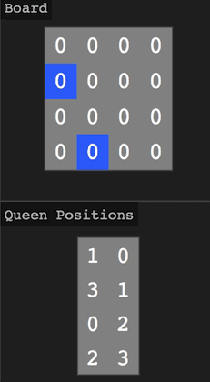
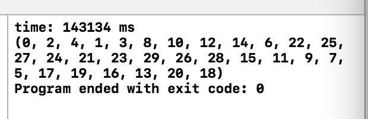

# Backtracking&Recursion

## 程序设计与算法分析

### 初步想法

- 放置皇后
    - 先在第一列放皇后，再放第二列......直到放到第N列。
    - 每次在放第i列，第j行时，判断是否发生攻击
        - 攻击，则移除第i列原位置的皇后
            - 原位置皇后在第N行，则移除第i-1列原位置的皇后，执行类似的递归行为。
            - 原位置皇后不在第N行，则放置第i列皇后于j+1行。
        - 不攻击，记录位置
    
### 代码实现

由初步想法进一步分析， **确定每列皇后的位置** ，都是相同的操作过程。  
是否攻击，攻击则移到下一行，移到最后一行仍攻击则 **失败** ；否则 **成功** 。  
这些相同的操作过程如何联系在一起呢？一种方法是通过递归函数。如果 **成功** 则调用下一列的递归函数，到N列 **停止** 。如果 **失败** ，需要对上一列调整。

	int validState {
		//验证是否有攻击，攻击则返回0，否则返回1
		//注意初始条件，即col=0时
	}
	int Q_n (col) {
		if (col>=N) return 1;
		row=0;
		while (row<N) {
			if (validState(row,col)) { //不攻击
				//记录位置
				Q_n (col+1);		
			}
			row++;
		}
		return 0;
	}
	Q_n (0); 
	
如果`while`循环结束仍没有进入下一层递归，函数直接返回0，返回后进入其上一层递归，开始`while`循环。  
但是以上，代码还存在问题。    
什么时候 **递归停止** 呢？ **col到了N的时候**，已经找到N个皇后布局了。（否则，第一列的row会加到N，跳出`while`，返回0。）

  

可以注意到，以上代码不能判断出已经找到N个皇后布局。找到的情况下，返回值为1，然而没有什么用，`while`循环还会继续下去。  

### 代码改错

问题出在返回值上。对递归函数运行后的不同情况（是／否已经到了第N+1列），有不同的返回值（1/0）。我们必须存下这个返回值，并及时地判断。  

	if (validState(row,col)) {
		//记录位置
		Q_n (col+1);
		found = nQ (currentQueen + 1, currentCol + 1);
		if (found==true) {
			return true;
		}
	}
	
同时在全局初始化`found`，即`var found=false;`

### 代码改进

time: 138034 ms

## 实验结果

### Backtracking&Recursion_0.cpp

最多跑了30个皇后：    
   

复杂度分析：
考虑上界（最坏情况），遍历整个解空间，为

皇后个数与执行时间的曲线：

  皇后个数（个）  |5   | 10   | 15 |  20 | 25   | 30
----------------|----|------|----|-----|------|---
  运行时间（ms） |1    | 2    | 2  | 231 |  84  | 143134
 
## 附件

代码改错后文件：  

[Backtracking&Recursion_0.cpp](./Backtracking&Recursion_0.cpp)
  
代码改进后文件：
  
js：[Backtracking&Recursion_1.js](./Backtracking&Recursion_1.cpp)；  
c++：[Backtracking&Recursion_1.cpp](./Backtracking&Recursion_1.cpp)  

